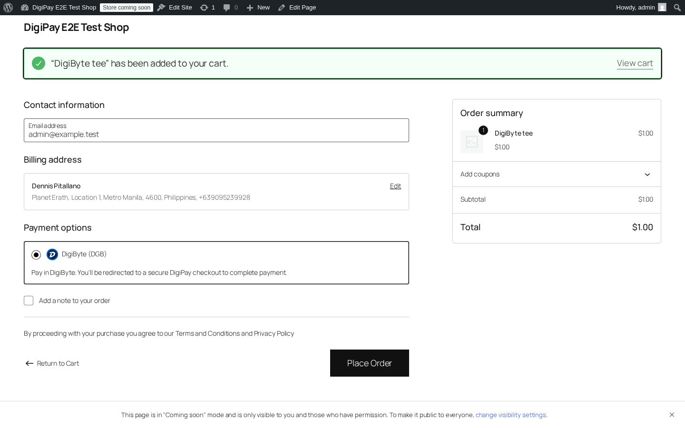
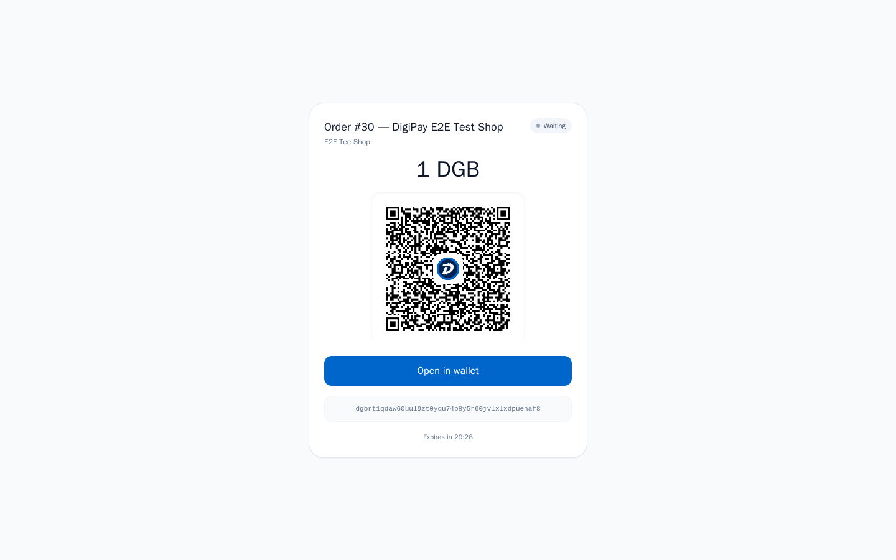
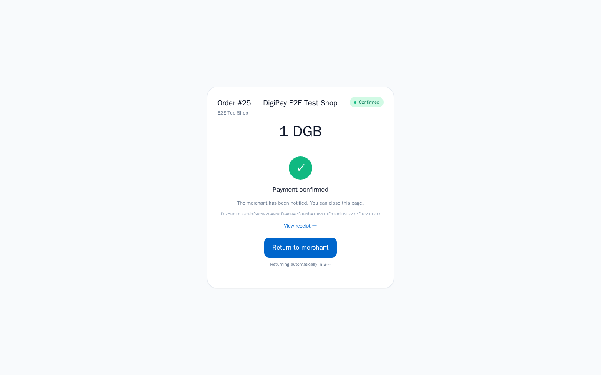
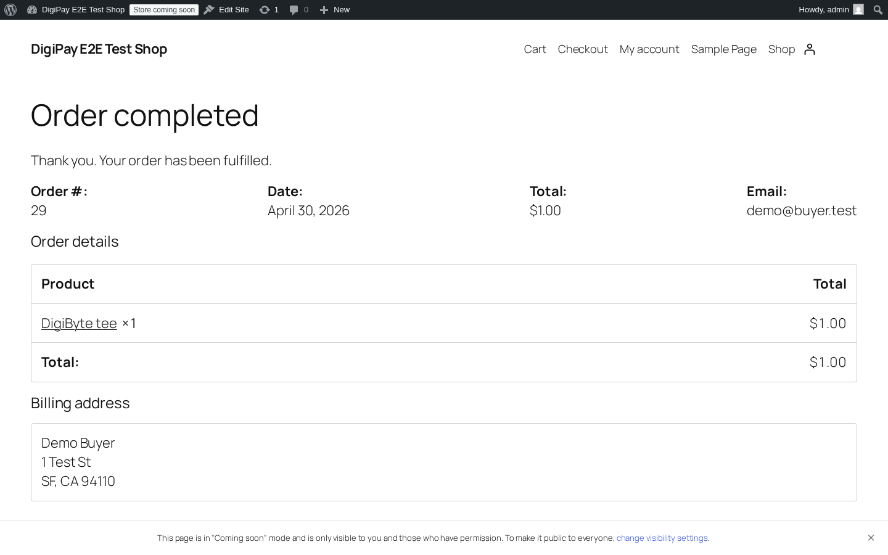
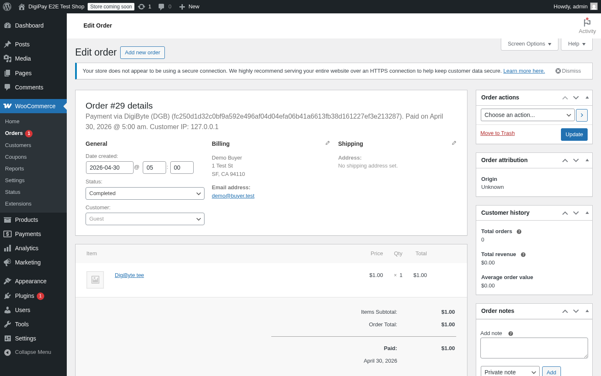

# Customer flow — what the buyer sees

A walk-through of every screen between "buyer adds to cart" and "back on
the merchant's thank-you page". Useful to show a merchant who's evaluating
the integration.

> Screenshots live in [`screenshots/`](screenshots/). The capture
> checklist + filenames are in [`screenshots/README.md`](screenshots/README.md).

---

## 1. The buyer picks DigiByte at checkout

WooCommerce checkout — the new block-based UI. DigiPay shows up under
_Payment options_ as **DigiByte (DGB)** with the official coin icon.

The plugin auto-hides this radio when the merchant hasn't pasted in an API
key + webhook secret — so a half-configured store never shows the option to
the buyer.

---

## 2. Place Order → DigiPay hosted checkout

Clicking _Place Order_ posts to the gateway's `process_payment()`, which
mints a DigiPay session via `POST /v1/pay/sessions` (with an idempotency
key derived from the WC order id) and returns a redirect to DigiPay's
hosted checkout page.

The buyer sees:

- The amount (DGB and the equivalent fiat)
- A QR they can scan with any DigiByte wallet
- The receive address (a fresh-derived BIP84 address, never reused)
- An expiry countdown (price-locked for 30 minutes by default)
- An _Open in wallet_ button that triggers the OS-registered `digibyte:` URI handler

---

## 3. Buyer pays. Watch the page.

DigiPay's `InvoiceMonitor` watches the chain. As soon as the tx hits the
mempool the page flips to **paid** (green pill); after 6 confirmations it
flips to **confirmed**.

In parallel, DigiPay fires HMAC-signed webhooks at the merchant. The plugin
verifies the signature against the raw POST body, looks up the WC order by
the session id stored in `_digipay_session_id` order meta, and advances the
WC order:

| DigiPay event | WC order state |
|---|---|
| `session.paid` | `processing` (txid recorded as transaction id) |
| `session.confirmed` | `completed` |
| `session.expired` | `failed` |
| `session.underpaid` | `on-hold` (manual review) |

---

## 4. Auto-redirect back to the merchant

Once the session reaches `confirmed`, the hosted checkout shows:

- A **Return to merchant** button (clickable immediately)
- A 5-second auto-redirect countdown

After 5s (or earlier if the buyer clicks), the browser navigates to the
`returnUrl` the plugin sent on session create — which is WC's per-order
thank-you page. The order key is part of the URL so each buyer is sent to
their own page.

---

## 5. The WC thank-you page

By the time the buyer lands here, the WC order has already been advanced
to `processing` (or `completed` if 6 confs landed before the redirect).
The thank-you page shows the order summary, expected delivery, and the
order id.

---

## 6. The merchant's view

In the WC admin, the order shows:

- Status: _Completed_ (or _Processing_ if waiting on confirmations)
- Transaction id recorded as the order's payment transaction id
- Order notes: a session-created note from `process_payment()`, then
  webhook-driven notes for `session.paid` / `session.confirmed`

In the DigiPay dashboard's Sessions tab, the same session shows up with
a small "↩ <merchant-host>" chip next to the order — the plugin sends
the WC thank-you URL as `returnUrl` on session create, and the
dashboard surfaces the host so a merchant glancing at the list can spot
which store the session came from. Useful when one DigiPay account
fronts multiple WC sites.

> _Dashboard screenshot pending — gated behind the merchant Digi-ID auth
> flow that didn't fit the headless capture. Tracked in the [screenshot
> checklist](screenshots/README.md)._

---

## What happens if things go wrong

- **Buyer closes the tab mid-payment** — they can re-open the order and
  the session is still there until expiry (30 min by default). Webhooks
  fire on chain activity regardless of whether the buyer has the page
  open.
- **Buyer pays half the amount** — `session.underpaid` fires; WC order
  goes to `on-hold` with a note showing received vs expected. Merchant
  reviews and either ships, refunds (off-platform — DigiByte is non-
  custodial), or asks for a top-up.
- **Buyer's tx confirms after the session expired** — DigiPay's late-
  payment reconciliation still records the payment and fires
  `session.paid` against the original session. The WC order picks up the
  new state from the webhook even after the customer is long gone.
- **Webhook retried** — every webhook delivery has a unique
  `X-DigiPay-Delivery: wdel_…` id. The plugin records the last applied
  delivery on the order; replays of the same id are ack-and-skipped.
- **Webhook secret leaks** — the plugin enforces a 5-minute timestamp
  tolerance, so an attacker can't replay an old captured delivery
  indefinitely. Rotate the secret in the DigiPay dashboard
  (_Stores → Webhooks_) — the plugin only needs the new value pasted in.
