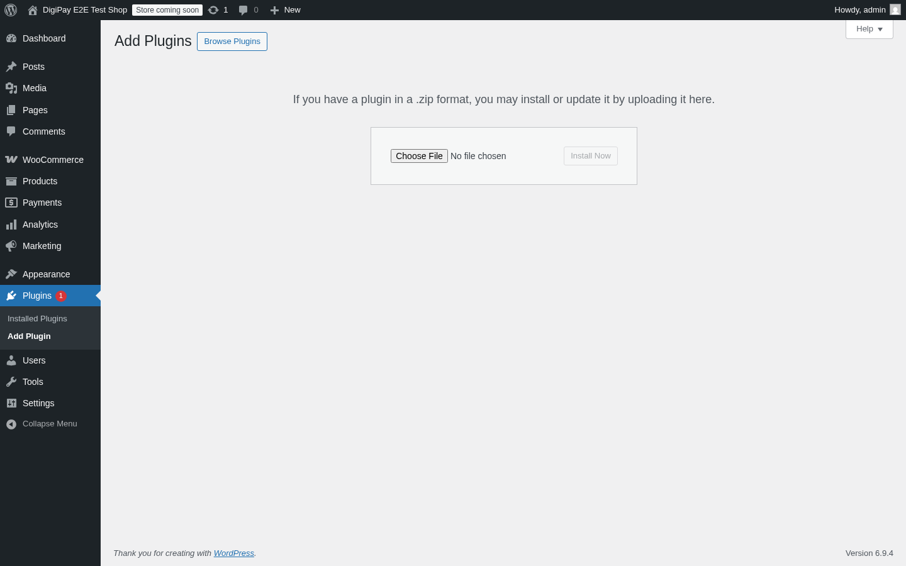
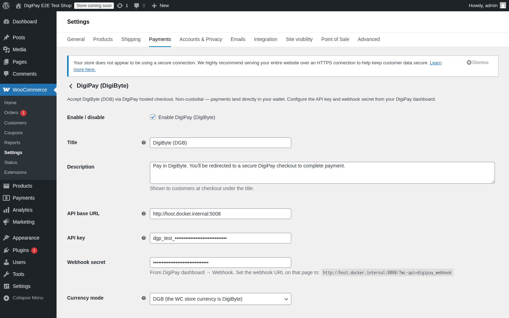

# Install guide — DigiPay for WooCommerce

A merchant-facing step-by-step. Takes ~10 minutes the first time you do it,
~2 minutes once you've done it before. By the end you'll have:

- The plugin installed and active on your WooCommerce store
- A DigiPay merchant account with one store wired up
- DigiByte (DGB) showing as a payment option at checkout
- A verified test order that flowed end-to-end

If you'd rather see what the **buyer** sees, jump to the [customer flow walkthrough](customer-flow.md).

---

## Before you start

You'll need:

| | |
|---|---|
| A WooCommerce store | running on WP 6.0+, WC 7.0+, PHP 7.4+ |
| Your store's URL | the public one, e.g. `https://yourshop.example` |
| A DigiByte address or BIP84 xpub | where DGB payments will land. If you don't have one yet, install [DigiByte Wallet](https://dgbwallet.app) first and create one |
| 5 minutes | for the install + a test order |

Outbound HTTPS is required (the plugin fetches DGB prices from CoinGecko for
fiat-priced orders).

---

## Step 1 — Get the plugin ZIP

Two ways:

- **Recommended**: download `digipay-for-woocommerce-0.1.0.zip` from the
  [GitHub releases](https://github.com/DennisPitallano/digibyte-wallet/releases) page.
- **From source**: clone the repo and run
  ```bash
  cd samples
  zip -r digipay-for-woocommerce-0.1.0.zip woocommerce-plugin
  ```
  (or run [`scripts/build-woocommerce-zip.sh`](../../../scripts/build-woocommerce-zip.sh)
  from the repo root, which strips the `tests/` folder and packages it under
  the right slug).

---

## Step 2 — Upload + activate

In WordPress admin go to _**Plugins → Add New → Upload Plugin**_. Choose the
ZIP you downloaded and click _**Install Now**_.



After install, click _**Activate Plugin**_. The plugin is now loaded — but
not yet configured, so the gateway is automatically hidden at checkout
until you finish step 4. (No half-configured "broken" state for buyers to
stumble into.)

---

## Step 3 — Register a DigiPay merchant account

The plugin talks to a DigiPay backend, so you need an account there too.
Two paths:

### 3a. Hosted DigiPay (the easy one)

1. Go to [pay.dgbwallet.app](https://pay.dgbwallet.app).
2. Click _**Sign in**_ (uses [Digi-ID](https://www.digi-id.io/) — passwordless,
   sign in with any DigiByte wallet).
3. From the dashboard, create a **store** with your DigiByte address (or
   xpub for per-session derivation — recommended for privacy).
4. Under _**API keys**_, click _**Create**_. Copy the key — it starts with
   `dgp_…` and is only shown once.
5. Under _**Webhook**_, paste your store's webhook URL. The plugin's settings
   page will show you exactly what to paste — it looks like:
   ```
   https://yourshop.example/?wc-api=digipay_webhook
   ```
   DigiPay generates a webhook secret on save — copy that too.

### 3b. Self-hosted DigiPay

Same flow, but against your own deployment. Set the **API base URL** in
step 4 below to your self-hosted Pay.Api endpoint (defaults to
`https://pay.dgbwallet.app`).

---

## Step 4 — Configure the plugin

Go to _**WooCommerce → Settings → Payments → DigiPay (DigiByte)**_. Paste in
the API key + webhook secret from step 3 and tick _Enable DigiPay (DigiByte)_.



The settings page shows the exact webhook URL you should configure on the
DigiPay dashboard side — no guessing, no typos.

| Setting | What to choose |
|---|---|
| **Title** | What buyers see at checkout. Default is _DigiByte (DGB)_. |
| **Description** | One-line explainer under the title at checkout. |
| **API base URL** | Default `https://pay.dgbwallet.app`. Override only for self-hosted. |
| **API key** | The `dgp_…` key from step 3. |
| **Webhook secret** | The secret DigiPay generated on the Webhook tab. |
| **Currency mode** | _Fiat_ if your WC store is priced in USD/EUR/GBP/PHP/JPY (recommended — DigiPay converts to DGB at the live rate). _DGB_ if your store currency is DigiByte itself. |
| **Session expiry (seconds)** | Leave blank to use DigiPay's default of 1800s (30 min). |
| **Debug logging** | On while you're setting up; off in production. Logs to _WooCommerce → Status → Logs → digipay_. |

Click _**Save changes**_.

---

## Step 5 — Verify the gateway shows at checkout

Add any product to your cart and go to checkout. Under _Payment options_
you should now see _**DigiByte (DGB)**_ with the official DigiByte coin
mark.


If it's missing, the most likely cause is that one of the required fields
in step 4 is blank — the plugin auto-hides itself when api_key, webhook
secret, or a supported store currency is missing. Re-check the settings
page; the gateway will reappear once everything's filled in.

---

## Step 6 — Place a test order

Click _**Place Order**_ to mint your first DigiPay session. The plugin
posts to DigiPay's API (with an idempotency key derived from the WC order
id, so a double-clicked Place Order can never create two invoices) and
redirects you to DigiPay's hosted checkout:


You see:

- The amount (DGB and the equivalent fiat if you chose fiat mode)
- A QR code any DigiByte wallet can scan
- The receive address (a fresh-derived BIP84 address if you registered
  with an xpub — never reused)
- An expiry countdown
- An _Open in wallet_ button

Pay the invoice from any DigiByte wallet you control (any amount works for
testing if it's not connected to inventory).

Once the chain confirms, the page flips to:


The customer gets a 5-second auto-redirect (or can click the button
immediately) back to the WC thank-you page:


---

## Step 7 — Verify the order completed in WC admin

In WP admin go to _**WooCommerce → Orders**_ and open your test order.


You should see:

- Status: _**Completed**_
- The DigiByte txid recorded as the order's payment transaction id
- _Payment via DigiByte (DGB)_ with the txid in the order header
- Order notes containing the DigiPay session id and the
  `session.paid` / `session.confirmed` events as the webhook fires

If the status didn't advance, check:

1. **Webhook URL** is reachable from DigiPay's network. Localhost won't work
   for hosted DigiPay — use a tunnel like [ngrok](https://ngrok.com) for
   local testing, or configure the webhook URL with your public domain.
2. **Webhook secret** matches between the DigiPay dashboard and the plugin
   settings.
3. **Debug logging** is on — `WooCommerce → Status → Logs → digipay-…`
   shows every webhook attempt with the result.
4. **DigiPay dashboard → Stores → Webhook deliveries** shows the merchant
   side's view of every delivery attempt with response code + duration.

---

## Done. What's next?

- **Go live.** Switch to a production WP store with HTTPS, change the
  receive address to one you actually control (production xpub
  recommended), and place a real test order.
- **Decide on fulfilment.** The plugin advances orders to `processing` on
  `session.paid` (1 confirmation) and `completed` on `session.confirmed`
  (6+ confirmations). For high-value orders, ship on `completed` rather
  than `paid`.
- **Audit the webhook log.** _WooCommerce → Status → Logs → digipay-…_ is
  your audit trail of every event the plugin processed.
- **Hook into the WP filter** `digipay_gateway_icon` if you want to swap
  the DigiByte coin mark for your own brand mark at checkout.

For the buyer-side perspective on the same flow, see the
[customer flow walkthrough](customer-flow.md).
